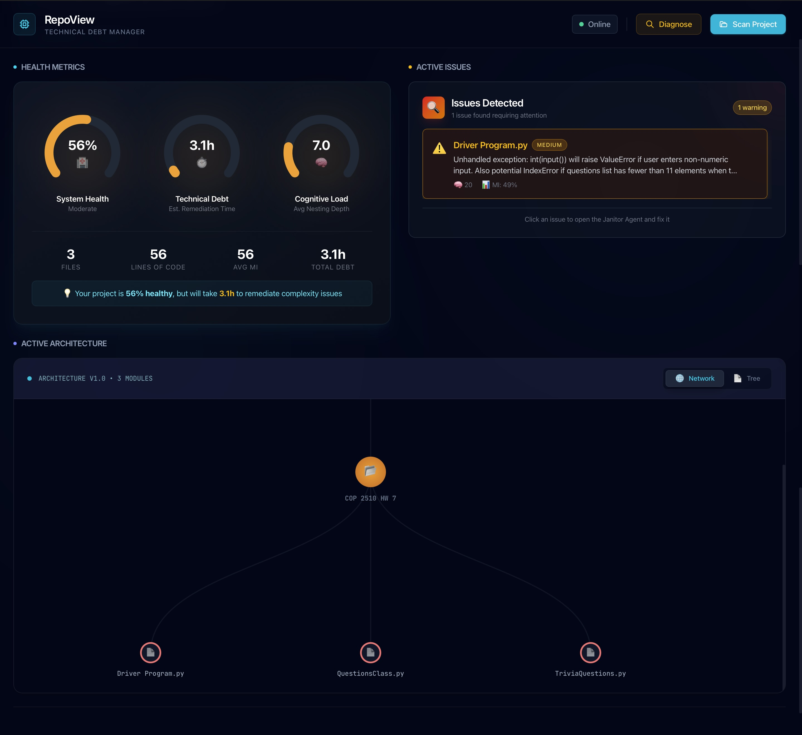

<div align="center">

# RepoView

### Mission Control for Technical Debt

**An Agentic IDE tool that visualizes complexity and autonomously refactors Python code using Claude 3 Opus.**

[](https://www.python.org/)
[](https://reactjs.org/)
[](https://anthropic.com/)

---

<!-- Replace with your actual screenshot -->


*The System Explorer — visualize your codebase architecture at a glance.*

</div>

---

## Why RepoView?

Most code analysis tools give you **numbers**. RepoView gives you **understanding**.

| Traditional Tools | RepoView |
|---|---|
| Static reports | Interactive visual map |
| Manual refactoring | AI-powered autonomous fixes |
| Cyclomatic complexity only | Cognitive complexity (readability) |
| Review diffs externally | Side-by-side diff with one-click apply |

---

##  Features

### 📊 Health Metrics Dashboard
Speedometer-style gauges showing real-time codebase health:
- **System Health** — Maintainability Index across all files
- **Technical Debt** — SQALE hours of remediation work
- **Cognitive Load** — Average function complexity

###  Visual Code Map
Interactive tree visualization of your project structure:
- Files sized by complexity
- Color-coded by health (green → yellow → red)
- Hover for detailed metrics
- Click to open file details

### 🤖 Janitor Agent
Autonomous bug-fixing powered by Claude 3 Opus:
1. **Diagnose** — Identify code issues automatically
2. **Reproduce** — Generate failing test scripts
3. **Fix** — Apply targeted refactoring
4. **Verify** — Confirm fix passes tests

###  Safe Mode
Never apply changes blindly:
- Side-by-side diff view
- Download patch files
- One-click apply or reject

---

##  Architecture Decisions

### Why Tree-sitter?

> **TL;DR:** AST-based accuracy over regex fragility.

Tree-sitter parses Python into a proper Abstract Syntax Tree, enabling:
- Accurate function boundary detection
- Nested scope analysis for cognitive complexity
- Language-agnostic extensibility (add TypeScript, Go, etc.)

Regex-based parsers break on edge cases. Tree-sitter doesn't.

### Why Cognitive Complexity?

> **TL;DR:** Measures how hard code is to *understand*, not just *execute*.

Traditional Cyclomatic Complexity counts branches. Cognitive Complexity penalizes:
- **Nesting depth** — Deeply nested code is harder to follow
- **Break in linear flow** — `try/catch`, `continue`, `break`
- **Multiple conditions** — `if a and b or c`

A function with CC=10 and flat structure is easier to read than CC=5 with 4 levels of nesting.

### Why Claude 4.5 Opus?

> **TL;DR:** Superior reasoning for multi-step refactoring tasks.

The Janitor Agent follows a TDD loop that requires:
1. Understanding the bug from a description
2. Writing a reproduction script
3. Generating a targeted fix
4. Iterating if verification fails

Opus consistently outperforms cheaper models on this reasoning chain. For simple classification tasks (issue categorization), we dynamically route to faster models.

---

##  Tech Stack

| Layer | Technology |
|-------|------------|
| **Frontend** | React 18, TypeScript, Tailwind CSS, Recharts |
| **Backend** | Python 3.11, FastAPI, Tree-sitter |
| **AI** | Anthropic Claude 4.5 Opus |
| **Sandbox** | Docker SDK (isolated code execution) |
| **Database** | SQLite (metric history) |

---

##  Quick Start

```bash
# Clone the repository
git clone https://github.com/AnthonyJSaade/Technical-Debt-Manager.git
cd Technical-Debt-Manager

# Backend setup
cd backend
python -m venv venv
source venv/bin/activate  # Windows: venv\Scripts\activate
pip install -r requirements.txt

# Frontend setup
cd ../frontend
npm install

# Configure environment
cp .env.example .env
# Add your ANTHROPIC_API_KEY to .env

# Run the application
# Terminal 1: Backend
cd backend && uvicorn app.main:app --reload --port 8000

# Terminal 2: Frontend
cd frontend && npm run dev
```

Open [http://localhost:5173](http://localhost:5173) and click **Scan Project** to analyze your first codebase.

---

##  Project Structure

```
Technical-Debt-Manager/
├── backend/
│   ├── app/
│   │   ├── agents/         # Janitor Agent, LLM interface
│   │   ├── analysis/       # Tree-sitter parser, scanner
│   │   └── main.py         # FastAPI application
│   └── requirements.txt
├── frontend/
│   ├── src/
│   │   ├── components/     # React components
│   │   ├── App.tsx         # Main application
│   │   └── api.ts          # Backend API client
│   └── package.json
└── README.md
```

---

##  Roadmap

- [ ] TypeScript support via Tree-sitter
- [ ] Git integration (show debt trends over commits)
- [ ] Team collaboration mode
- [ ] VS Code extension
- [ ] Custom complexity rules

---

##  License

MIT License — see [LICENSE](LICENSE) for details.


